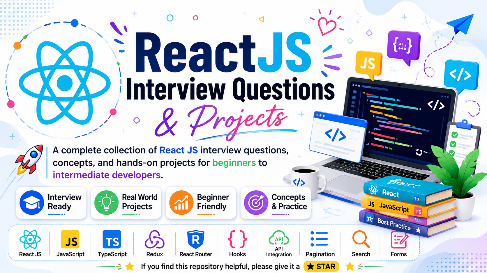

# 🚀 ReactJS Interview Questions & Projects

# A complete collection of **React JS Interview Questions, Concepts, and Hands-on Projects** for beginners and intermediate developers.

This repository contains practical React examples, mini-projects, and commonly asked interview topics.

## 📚 Topics Covered

* React Fundamentals
* Functional Components
* Class Components
* Props
* Forms
* API Consumption
* Pagination
* Live Search
* React Router
* useContext Hook
* useCallback Hook
* Redux
* TypeScript
* CRUD Applications

---

## 📂 Repository Structure

| Folder                                  | Description               |
| --------------------------------------- | ------------------------- |
| 1. ReactFirstProgram                    | Introduction to React     |
| 2. ReactFunctionalComponent             | Functional Components     |
| 3. ReactClassComponent                  | Class Components          |
| 4. tourapp                              | React Mini Project        |
| 5. Props                                | Props Concept             |
| 6. FormCreation                         | Form Handling             |
| 7. ApiConsumtion                        | API Fetching              |
| 8. Pagination                           | Pagination Implementation |
| 9. LiveSearch+ApiConsumption+Pagination | Combined Project          |
| 10. UseContext                          | useContext Hook           |
| 11. useCallback                         | useCallback Hook          |
| 12. ReactRouter                         | React Routing             |
| 13. Replacing_LinkTag_by_NavLink        | NavLink Example           |
| redux-react-demo                        | Redux Example             |
| TypeScript                              | React with TypeScript     |

---

## 💻 Technologies Used

* React JS
* JavaScript
* TypeScript
* Vite
* Redux
* React Router
* Axios
* CSS

---

## 🎯 Who is this repository for?

* Students preparing for React interviews.
* Beginners learning React.
* Developers revising React concepts.
* Anyone looking for React practice projects.

---

## ⭐ Support

If you find this repository helpful, please consider giving it a **star ⭐**.

---

## 👩‍💻 Author

**Shilpa Maity**

GitHub: https://github.com/shilpa-maity
